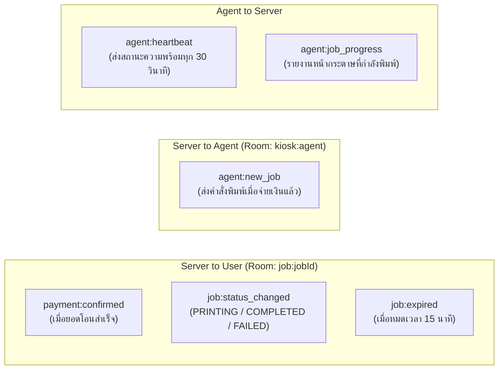

# ข้อกำหนดการเชื่อมต่อระบบ (API Contract & WebSocket Events)

เอกสารนี้ระบุข้อตกลงการรับ-ส่งข้อมูล (Interface Contract) ทั้งแบบ **RESTful API** และ **Real-time WebSocket (Socket.io)** ระหว่าง Frontend (User/Admin), Backend, Android Notification Listener และ Print Agent

---

## 1. มาตรฐาน RESTful API (`/api/v1`)

### 1.1 หมวดหมู่: การอัปโหลดไฟล์และประเมินราคา (Job & Quote)

#### `POST /api/v1/jobs/quote`
* **คำอธิบาย:** อัปโหลดไฟล์ PDF เพื่อตรวจสอบความถูกต้อง แกะจำนวนหน้า และดึงข้อมูลถาดกระดาษที่พร้อมใช้งาน
* **Content-Type:** `multipart/form-data`
* **Request:**
  - `file`: ไฟล์ PDF (สูงสุดไม่เกิน 50MB)
* **Response (200 OK):**
```json
{
  "success": true,
  "data": {
    "quoteId": "c4b3a120-1b7a-4296-857e-128a3f81e809",
    "fileName": "Project_Report_Final.pdf",
    "fileSizeBytes": 2411720,
    "pageCount": 18,
    "availableTrays": [
      {
        "id": "tray-1",
        "trayNumber": 1,
        "paperSize": "A4",
        "colorCapability": "MONOCHROME",
        "isActive": true
      },
      {
        "id": "tray-2",
        "trayNumber": 2,
        "paperSize": "A4",
        "colorCapability": "COLOR",
        "isActive": true
      }
    ],
    "pricingMatrix": [
      { "paperSize": "A4", "isColor": false, "isDuplex": false, "pricePerPage": 1.50 },
      { "paperSize": "A4", "isColor": false, "isDuplex": true, "pricePerPage": 2.50 },
      { "paperSize": "A4", "isColor": true, "isDuplex": false, "pricePerPage": 5.00 },
      { "paperSize": "A4", "isColor": true, "isDuplex": true, "pricePerPage": 9.00 }
    ]
  }
}
```

---

#### `POST /api/v1/jobs/create`
* **คำอธิบาย:** ยืนยันการตั้งค่าพิมพ์ สร้างคิวงาน บันทึกเศษสตางค์ และสร้าง PromptPay Dynamic QR Code
* **Content-Type:** `application/json`
* **Request Body:**
```json
{
  "quoteId": "c4b3a120-1b7a-4296-857e-128a3f81e809",
  "copies": 1,
  "pageRange": "all",
  "paperSize": "A4",
  "isColor": false,
  "isDuplex": true,
  "duplexEdge": "LONG_EDGE"
}
```
* **Response (201 Created):**
```json
{
  "success": true,
  "data": {
    "jobId": "f90b1e42-7a54-46b5-9f5e-13c544fa9202",
    "orderCode": "TCP-20260914-042",
    "pageCount": 18,
    "copies": 1,
    "baseAmount": 23,
    "satangAmount": 43,
    "totalAmount": 23.43,
    "promptPayPayload": "00020101021229370016A000000677010111011300668123456785303764540523.435802TH6304ABCD",
    "qrCodeDataUrl": "data:image/png;base64,iVBORw0KGgo...",
    "expiresAt": "2026-09-14T13:45:00+07:00",
    "expiresInSeconds": 900
  }
}
```

---

### 1.2 หมวดหมู่: ระบบชำระเงิน (Payments)

#### `POST /api/v1/payments/webhook` (Flow A: Android Listener)
* **คำอธิบาย:** รับแจ้งเตือนเงินเข้าจากแอป Android เพื่อ Match ยอดเงินกับงานที่รออยู่
* **Headers:**
  - `X-Webhook-Secret`: `<PRESHARED_SECRET_KEY>`
* **Request Body:**
```json
{
  "bank": "KBANK",
  "amount": 23.43,
  "rawText": "เงินเข้า 23.43 บ. บัญชี xxx-xxx1234 เวลา 13:35 น.",
  "timestamp": "2026-09-14T13:35:12+07:00"
}
```
* **Response (200 OK):**
```json
{
  "success": true,
  "matched": true,
  "jobId": "f90b1e42-7a54-46b5-9f5e-13c544fa9202",
  "orderCode": "TCP-20260914-042"
}
```

---

#### `POST /api/v1/payments/verify-slip` (Flow B: OCR Fallback)
* **คำอธิบาย:** ผู้ใช้อัปโหลดภาพสลิปเพื่อตรวจสอบยอดเงินผ่าน OCR เมื่อระบบหลักดีเลย์
* **Content-Type:** `multipart/form-data`
* **Request:**
  - `jobId`: `"f90b1e42-7a54-46b5-9f5e-13c544fa9202"`
  - `slipImage`: ไฟล์ภาพสลิป (PNG/JPEG)
* **Response (200 OK):**
```json
{
  "success": true,
  "data": {
    "jobId": "f90b1e42-7a54-46b5-9f5e-13c544fa9202",
    "extractedAmount": 23.43,
    "transactionRef": "202609141334001928",
    "status": "PAID"
  }
}
```

---

### 1.3 หมวดหมู่: ฮาร์ดแวร์และตัวสั่งพิมพ์ (Print Agent)

#### `GET /api/v1/agent/jobs/:id/download`
* **Headers:** `X-Agent-Token: <SECRET>`
* **Response:** Stream ไฟล์ PDF ตัวจริงเพื่อส่งเข้า Spooler

#### `POST /api/v1/agent/jobs/:id/complete`
* **Headers:** `X-Agent-Token: <SECRET>`
* **Request Body:**
```json
{
  "status": "COMPLETED",
  "printedPages": 18,
  "executionDurationMs": 14200
}
```

#### `POST /api/v1/agent/jobs/:id/error`
* **Request Body:**
```json
{
  "status": "FAILED",
  "errorCode": "OUT_OF_PAPER",
  "detail": "Tray 1 ran out of paper during page 12"
}
```

---

### 1.4 หมวดหมู่: ผู้ดูแลระบบ (Admin)

* `GET /api/v1/admin/trays`: ดึงสถานะถาดกระดาษทั้งหมด
* `PATCH /api/v1/admin/trays/:id`: ปรับสถานะถาด (เปิด/ปิด, อัปเดตปริมาณกระดาษ)
* `GET /api/v1/admin/jobs`: ดึงรายการคิวงานและประวัติย้อนหลัง พร้อม Filter ตามสถานะ
* `GET /api/v1/admin/stats`: สรุปยอดรายได้ จำนวนแผ่นที่พิมพ์ แยกตามวันและเดือน

---

## 2. ข้อกำหนด Real-time WebSocket Events (Socket.io)

### 2.1 ห้องการเชื่อมต่อ (Rooms)
1. **User Room:** `job:<jobId>` — ผู้ใช้แต่ละคนจะ Join เฉพาะห้องของตนเองเพื่อรับอัปเดตสถานะ
2. **Admin Room:** `kiosk:admin` — สำหรับแดชบอร์ดแอดมินรับข้อมูลสถิติสด
3. **Agent Room:** `kiosk:agent` — สำหรับ Print Agent รับคำสั่งงานใหม่

### 2.2 รายการ Events



#### Payload: `payment:confirmed`
```json
{
  "jobId": "f90b1e42-7a54-46b5-9f5e-13c544fa9202",
  "status": "PAID",
  "confirmedAt": "2026-09-14T13:35:15+07:00",
  "message": "ชำระเงินสำเร็จ กำลังส่งข้อมูลไปยังเครื่องพิมพ์"
}
```

#### Payload: `agent:new_job`
```json
{
  "jobId": "f90b1e42-7a54-46b5-9f5e-13c544fa9202",
  "downloadToken": "sec_token_912384",
  "printSettings": {
    "paperSize": "A4",
    "isColor": false,
    "isDuplex": true,
    "duplexEdge": "LONG_EDGE",
    "trayNumber": 1,
    "copies": 1,
    "pageRange": "all"
  }
}
```
