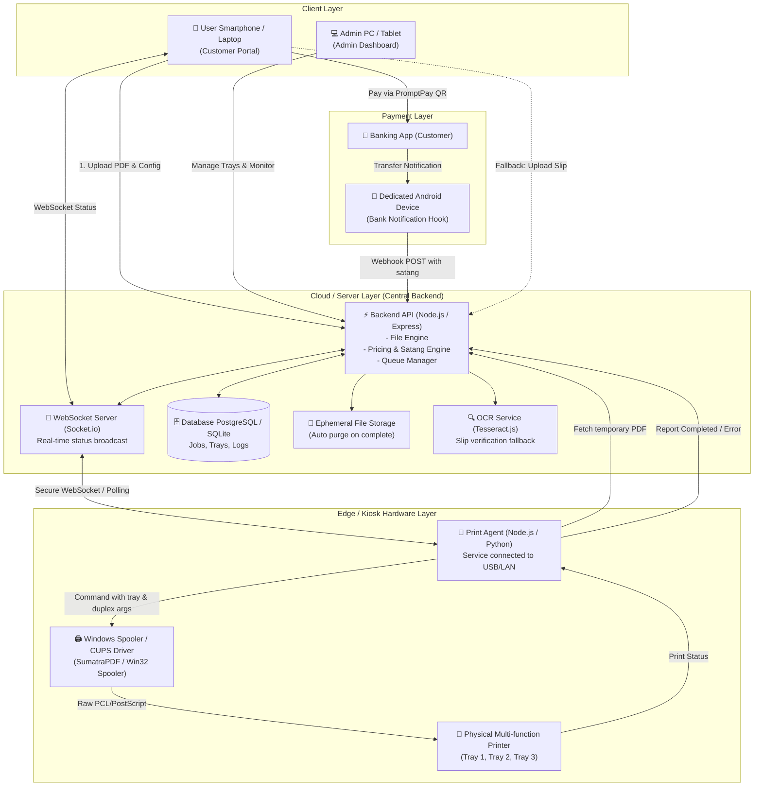
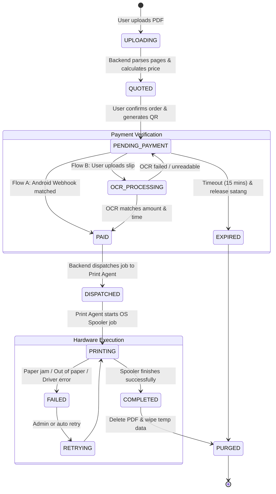

# สถาปัตยกรรมระบบเครื่องพิมพ์อัตโนมัติ (Automated Print Kiosk Architecture)

เอกสารนี้ระบุรายละเอียดสถาปัตยกรรมทางเทคนิค (Technical Architecture) และการออกแบบเชิงโครงสร้างของระบบเครื่องพิมพ์เอกสารอัตโนมัติ (Automated Print Kiosk) หรือ **TCprinter** เพื่อให้รองรับการทำงานแบบ Self-service ตลอด 24 ชม. ปลอดภัย เชื่อถือได้ และมีต้นทุนการดูแลรักษาต่ำ

---

## 1. ภาพรวมสถาปัตยกรรมระดับสูง (High-Level Architecture)

ระบบประกอบด้วย 4 โมดูลหลักที่ทำงานร่วมกันแบบ Real-time:

---

## 2. องค์ประกอบหลักทั้ง 4 โมดูล (Core Modules Breakdown)

### 2.1 โมดูลที่ 1: ส่วนติดต่อผู้ใช้งานและผู้ดูแลระบบ (Frontend Web - Next.js)
* **Framework:** Next.js 14+ (App Router), Tailwind CSS, Lucide Icons, Shadcn UI / Radix primitives
* **User Portal (หน้าสำหรับผู้ใช้ทั่วไป):**
  - ออกแบบเป็น Mobile-first Responsive รองรับการเปิดผ่านมือถือผู้ใช้ (สแกน QR Code หน้าตู้) หรือหน้าจอ Touchscreen ประจำตู้
  - **PDF Dropper & Analyzer:** อัปโหลดไฟล์ ตรวจสอบความถูกต้อง แสดงพรีวิวหน้าแรก พร้อมคำนวณจำนวนหน้า
  - **Print Configurator:** เลือกขนาดกระดาษ (A4, A3), รูปแบบสี (ขาวดำ / สี), การพิมพ์หน้า-หลัง (หน้าเดียว / หน้า-หลังแบบพลิกด้านยาว-ด้านสั้น), จำนวนชุด, และช่วงหน้าที่ต้องการพิมพ์
  - **Dynamic Price Breakdown:** คำนวณราคาสดทันทีที่ปรับแต่งตัวเลือก พร้อมแจ้งราคารวมที่มีเศษสตางค์
  - **PromptPay QR Code Display:** แสดง QR Code ตามมาตรฐาน EMVCo PromptPay พร้อมยอดเงินรวมเศษสตางค์ที่สุ่มเฉพาะออร์เดอร์นั้น
  - **Live Status Tracker:** แสดงสถานะสดผ่าน WebSocket: `รอการชำระเงิน` $\rightarrow$ `ยืนยันยอดเงินสำเร็จ` $\rightarrow$ `กำลังพิมพ์...` $\rightarrow$ `พิมพ์เสร็จสมบูรณ์`
  - **Slip Fallback Button:** ปุ่มอัปโหลดสลิปสำหรับกรณีที่การแจ้งเตือนอัตโนมัติล่าช้า
* **Admin Dashboard (หน้าสำหรับผู้ดูแลตู้):**
  - **Tray Mapping & Status:** ตั้งค่าถาดกระดาษแต่ละช่อง (Tray 1, Tray 2, Tray 3) ระบุชนิด/ขนาดกระดาษ และโหมดสี พร้อมสวิตช์เปิด/ปิดถาด หากกระดาษหมด ตัวเลือกหน้าบ้านจะปิดอัตโนมัติ
  - **Pricing Matrix Config:** กำหนดอัตราค่าบริการต่อหน้าตามขนาดกระดาษ, สี, และหน้า-หลัง
  - **Live Queue & Audit History:** ดูคิวงานที่กำลังรอพิมพ์ ยอดเงินที่รับเข้ามา และประวัติการพิมพ์ย้อนหลัง

---

### 2.2 โมดูลที่ 2: ระบบประมวลผลกลาง (Backend API - Node.js / Express)
* **Runtime & Framework:** Node.js, Express.js, TypeScript
* **File Engine:**
  - จัดการไฟล์อัปโหลดอย่างปลอดภัยผ่าน Multer
  - วิเคราะห์ไฟล์ PDF ด้วย `pdf-parse` / `pdf-lib` นับจำนวนหน้าที่ถูกต้อง และตรวจสอบขนาดหน้ากระดาษ
  - จัดเก็บไฟล์ในที่เก็บชั่วคราวที่มีการตั้งค่าสิทธิ์เข้มงวด
* **Pricing & Satang Allocation Engine:**
  - ตรวจสอบกฎราคาจากฐานข้อมูล คำนวณราคารวม:
    $$\text{Price} = \sum (\text{Pages} \times \text{Rate}_{\text{color, duplex, size}}) \times \text{Copies}$$
  - ทำการจัดสรรเศษสตางค์ `.01` ถึง `.99` ให้ไม่ซ้ำกับออร์เดอร์ที่ค้างชำระอยู่ในช่วง 15 นาที เพื่อแยกแยะยอดโอน
* **Queue & Logic Manager:**
  - สร้าง Record ในฐานข้อมูลสถานะ `PENDING_PAYMENT`
  - ทำหน้าที่เป็น Gatekeeper ตรวจสอบว่าเงื่อนไขการพิมพ์ที่ผู้ใช้เลือก (เช่น กระดาษ A3 สี) มีถาดที่พร้อมใช้งานในระบบจริงหรือไม่
* **WebSocket Server (Socket.io):**
  - จัดการ Room ตาม `jobId` หรือ `sessionToken`
  - กระจายเหตุการณ์ (Event Broadcast) ไปยัง Client และ Print Agent

---

### 2.3 โมดูลที่ 3: ระบบชำระเงินแบบ Hybrid (Hybrid Payment Gateway)
ทำงาน 2 ช่องทางแบบไร้รอยต่อ (Zero Cost, No Monthly Fee):
* **ช่องทางหลัก (Auto Notification Webhook):**
  - ใช้โทรศัพท์ Android เครื่องสำรองที่ติดตั้งแอปตรวจจับ Notification (เช่น Tasker หรือ Custom Companion Listener)
  - เมื่อมี Notification เงินเข้าจากแอปธนาคาร (K PLUS, SCB EASY, Krungthai, ฯลฯ) แอปจะดักจับและส่ง HTTP POST เข้า `/api/v1/payments/webhook` พร้อม Secret Signature
  - Backend นำยอดเงินที่มีเศษสตางค์จับคู่กับคิวที่รออยู่ หากยอดตรงและเวลาอยู่ในกรอบ $\rightarrow$ ปรับสถานะเป็น `PAID` ทันที
* **ช่องทางสำรอง (OCR Slip Fallback):**
  - กรณีผู้ใช้โอนแล้วแต่ Webhook ดีเลย์ ผู้ใช้สามารถกดส่งรูปสลิป
  - Backend ส่งภาพสลิปเข้า Engine OCR (Tesseract.js) สกัดยอดเงิน วันที่ และเวลา
  - นำยอดเงินและเวลาไปตรวจสอบความสอดคล้อง พร้อมบันทึก Slip Signature ป้องกันการนำสลิปเก่ามาใช้ซ้ำ (Anti-replay)

---

### 2.4 โมดูลที่ 4: ตัวกลางสั่งพิมพ์และฮาร์ดแวร์ (Print Agent & Hardware)
* **Agent Runtime:** Node.js หรือ Python Service ทำงานบนเครื่อง Edge Host (Mini PC / Raspberry Pi / Windows Kiosk Box) ที่เชื่อมต่อเครื่องพิมพ์
* **Driver & Command Integration:**
  - บน Windows: สั่งพิมพ์แบบ Silent Print ผ่าน `SumatraPDF.exe` CLI หรือ Windows Print Spooler API (`win32print`)
  - รองรับ Parameter:
    - `-print-to <PrinterName>`
    - `-print-settings "<copies>x,color,duplex,paper=A4,bin=<TrayNumber>"`
  - บน Linux: สั่งพิมพ์ผ่านคำสั่ง `lp` หรือ `lpr` ร่วมกับ CUPS PPD Options
* **Job Execution Flow:**
  - Subscribe รับ Job Payload จาก Backend เมื่อคิวเปลี่ยนเป็น `PAID`
  - ดาวน์โหลดไฟล์ PDF มาเก็บไว้ใน Temporary Cache
  - ส่งคำสั่ง Print ไปยัง Spooler พร้อมตรวจสอบ Error Code
  - ส่ง Callback กลับไปยัง Backend แจ้งผลลัพธ์ (`SUCCESS` หรือ `FAILED`) พร้อมลบไฟล์ Cache ในเครื่องทันที

---

## 3. วงจรชีวิตของงานพิมพ์ (Print Job Lifecycle State Machine)

---

## 4. นโยบายความปลอดภัยและการคุ้มครองข้อมูลส่วนบุคคล (PDPA & Security)

เนื่องจากระบบนี้ใช้พิมพ์เอกสารส่วนบุคคล (เช่น สำเนาบัตรประชาชน, รายงาน, เอกสารสัญญา):

1. **Ephemeral File Storage (ไม่เก็บไฟล์ถาวร):**
   - ไฟล์ PDF ทั้งหมดจะถูกเก็บในโฟลเดอร์ชั่วคราว (`/temp/uploads/`) ด้วยชื่อไฟล์ UUID สุ่ม
   - ไฟล์จะถูกลบทันที (`fs.unlink`) เมื่อสถานะเปลี่ยนเป็น `COMPLETED` หรือ `EXPIRED`
   - มีระบบ Cron Job ทำความสะอาดขยะ (Garbage Collection) ทุก 30 นาที กวาดลบไฟล์ที่ค้างเกินอายุ
2. **Access Control & Secure Token:**
   - ไฟล์เอกสารไม่สามารถเข้าถึงผ่าน URL สาธารณะได้โดยตรง (ห้ามเปิด Public Static Serving)
   - การดาวน์โหลดไฟล์จาก Print Agent ต้องใช้ One-Time Job Secret Token
3. **Payment Security:**
   - Webhook จาก Android Device ต้องมีการแนบ Shared Secret Key ใน Header (`x-webhook-secret`)
   - ระบบสแกนสลิปมีการคำนวณ Hashing ของภาพสลิปเพื่อป้องกัน Double Spending
