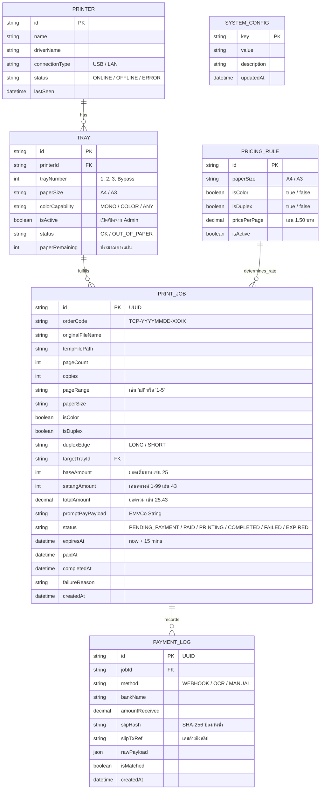

# แบบจำลองฐานข้อมูล (Database Schema Specification)

เอกสารนี้ระบุการออกแบบโครงสร้างฐานข้อมูล (Entity-Relationship Design) สำหรับระบบ **TCprinter** โดยใช้ **Prisma ORM** ซึ่งสามารถทำงานร่วมกับ **PostgreSQL** (สำหรับระบบจริง / Production) หรือ **SQLite** (สำหรับการพัฒนาและทดสอบในเครื่องเดียวแบบ All-in-one)

---

## 1. แผนผังความสัมพันธ์ข้อมูล (Entity-Relationship Diagram)



---

## 2. นิยามโครงสร้างข้อมูล Prisma Schema (`prisma/schema.prisma`)

```prisma
datasource db {
  provider = "postgresql" // หรือ "sqlite" ในโหมดพัฒนา
  url      = env("DATABASE_URL")
}

generator client {
  provider = "prisma-client-js"
}

enum JobStatus {
  PENDING_PAYMENT
  PAID
  DISPATCHED
  PRINTING
  COMPLETED
  FAILED
  CANCELLED
  EXPIRED
}

enum PaymentMethod {
  NOTIFICATION_WEBHOOK
  OCR_SLIP
  MANUAL_ADMIN
}

enum TrayStatus {
  OK
  OUT_OF_PAPER
  PAPER_JAM
  DISABLED
}

enum ColorCapability {
  MONOCHROME
  COLOR
  ANY
}

enum DuplexEdge {
  NONE
  LONG_EDGE
  SHORT_EDGE
}

model Printer {
  id             String      @id @default(uuid())
  name           String      @unique
  driverName     String
  connectionType String      @default("USB") // "USB" | "LAN"
  status         String      @default("ONLINE")
  lastSeen       DateTime    @default(now())
  trays          Tray[]
  createdAt      DateTime    @default(now())
  updatedAt      DateTime    @updatedAt
}

model Tray {
  id              String          @id @default(uuid())
  printerId       String
  printer         Printer         @relation(fields: [printerId], references: [id], onDelete: Cascade)
  trayNumber      Int             // 1, 2, 3
  paperSize       String          @default("A4") // "A4", "A3"
  colorCapability ColorCapability @default(ANY)
  isActive        Boolean         @default(true)
  status          TrayStatus      @default(OK)
  paperRemaining  Int             @default(500)
  printJobs       PrintJob[]
  updatedAt       DateTime        @updatedAt

  @@unique([printerId, trayNumber])
}

model PricingRule {
  id           String   @id @default(uuid())
  paperSize    String   // "A4", "A3"
  isColor      Boolean  @default(false)
  isDuplex     Boolean  @default(false)
  pricePerPage Decimal  @db.Decimal(10, 2)
  isActive     Boolean  @default(true)
  updatedAt    DateTime @updatedAt

  @@unique([paperSize, isColor, isDuplex])
}

model PrintJob {
  id               String        @id @default(uuid())
  orderCode        String        @unique // e.g. "TCP-20260914-001"
  originalFileName String
  tempFilePath     String?       // ลบค่านี้ทิ้งเมื่อพิมพ์เสร็จ
  pageCount        Int
  copies           Int           @default(1)
  pageRange        String        @default("all")
  paperSize        String        @default("A4")
  isColor          Boolean       @default(false)
  isDuplex         Boolean       @default(false)
  duplexEdge       DuplexEdge    @default(NONE)
  targetTrayId     String?
  targetTray       Tray?         @relation(fields: [targetTrayId], references: [id])
  
  // การเงินและเศษสตางค์
  baseAmount       Int           // ยอดเต็มบาท เช่น 25
  satangAmount     Int           // เศษสตางค์ 1-99 เช่น 43
  totalAmount      Decimal       @db.Decimal(10, 2) // 25.43
  promptPayPayload String        @db.Text
  
  status           JobStatus     @default(PENDING_PAYMENT)
  failureReason    String?
  
  // Timestamps & TTL
  expiresAt        DateTime      // เวลาหมดอายุของเศษสตางค์ (now + 15 นาที)
  paidAt           DateTime?
  completedAt      DateTime?
  createdAt        DateTime      @default(now())
  updatedAt        DateTime      @updatedAt

  paymentLogs      PaymentLog[]

  // Indexes สำคัญเพื่อค้นหายอดเงินและเศษสตางค์ได้รวดเร็ว
  @@index([baseAmount, status, createdAt])
  @@index([totalAmount, status])
  @@index([status, expiresAt])
}

model PaymentLog {
  id             String        @id @default(uuid())
  jobId          String?
  job            PrintJob?     @relation(fields: [jobId], references: [id])
  method         PaymentMethod
  bankName       String?
  amountReceived Decimal       @db.Decimal(10, 2)
  slipHash       String?       @unique // Hash SHA-256 ป้องกันใช้สลิปซ้ำ
  slipTxRef      String?       // รหัสธุรกรรมจากสลิป
  rawPayload     Json?         // ข้อมูลดิบจาก Webhook หรือ OCR
  isMatched      Boolean       @default(false)
  createdAt      DateTime      @default(now())

  @@index([slipHash])
}

model SystemConfig {
  key         String   @id
  value       String   @db.Text
  description String?
  updatedAt   DateTime @updatedAt
}
```

---

## 3. ดัชนีและการปรับแต่งประสิทธิภาพ (Indexing Strategy)

1. **`@@index([baseAmount, status, createdAt])`:**
   - ใช้ในขั้นตอนการสุ่มเศษสตางค์ `.01` ถึง `.99` เพื่อหาว่ามียอดบาทเดียวกันที่กำลังรอชำระเงินอยู่ใน 15 นาทีที่ผ่านมาหรือไม่ ทำให้ Query ได้ผลในระดับ Milliseconds
2. **`@@index([totalAmount, status])`:**
   - ใช้ในขั้นตอนเมื่อมี Webhook แจ้งเตือนเงินเข้า นำ `amount` (เช่น 25.43) มา Match กับ Job ที่สถานะ `PENDING_PAYMENT` ได้ทันที
3. **`slipHash @unique`:**
   - ป้องกันการโจมตีนำสลิปเดิมมาอัปโหลดซ้ำ (Anti-replay attack) โดย Database จะ Reject ทันทีในระดับ Constraints
