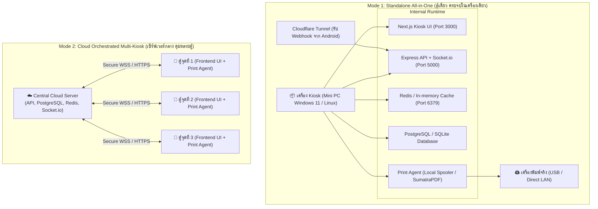
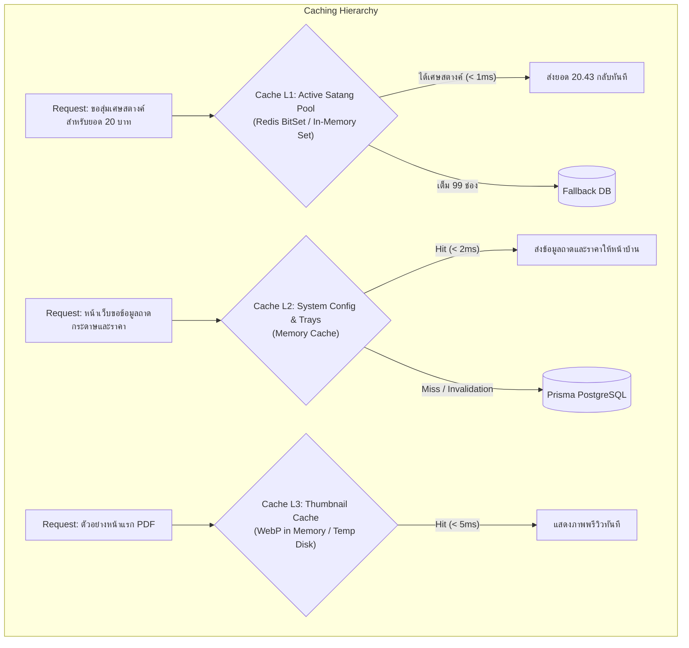

# สถาปัตยกรรมโครงสร้างพื้นฐาน ระบบแคช และการเพิ่มประสิทธิภาพความลื่นไหล (Infrastructure, Caching & Performance Architecture)

เอกสารนี้ระบุการออกแบบเชิงวิศวกรรมสำหรับ **โครงสร้างพื้นฐาน (Infrastructure)**, **ระบบแคช (Caching Engine)** และ **เทคนิคการทำให้ระบบทำงานได้อย่างลื่นไหล รวดเร็ว และทนทาน (Low-Latency & Resilient Flow)** ของระบบตู้พิมพ์เอกสารอัตโนมัติ **TCprinter**

---

## 1. รูปแบบการติดตั้งโครงสร้างพื้นฐาน (Deployment Topologies)

ระบบถูกออกแบบให้รองรับ 2 รูปแบบการติดตั้งตามขนาดและบริบทการใช้งาน:



### 1.1 Process Management (การจัดการโปรเซสด้วย PM2)
ใช้ **PM2** สำหรับการบริหารโปรเซสในโหมด Production เพื่อให้เกิดความเสถียร มีระบบ Auto-restart หากเกิดข้อผิดพลาด และเปิดทำงานอัตโนมัติเมื่อเปิดเครื่อง (Boot on startup):

```javascript
// ecosystem.config.js
module.exports = {
  apps: [
    {
      name: 'tcprinter-backend',
      cwd: './backend',
      script: 'dist/app.js',
      instances: 1,
      autorestart: true,
      watch: false,
      max_memory_restart: '500M',
      env: {
        NODE_ENV: 'production',
        PORT: 5000,
      },
    },
    {
      name: 'tcprinter-frontend',
      cwd: './frontend',
      script: 'node_modules/next/dist/bin/next',
      args: 'start -p 3000',
      instances: 1,
      autorestart: true,
      max_memory_restart: '500M',
      env: {
        NODE_ENV: 'production',
      },
    },
    {
      name: 'tcprinter-agent',
      cwd: './print-agent',
      script: 'dist/index.js',
      instances: 1,
      autorestart: true,
      max_memory_restart: '300M',
      env: {
        NODE_ENV: 'production',
      },
    },
  ],
};
```

### 1.2 Secure Reverse Proxy & Webhook Tunneling (Cloudflare Tunnel)
เพื่อรองรับการรับ Webhook จากโทรศัพท์ Android ภายนอก โดยไม่ต้องขอ Public IP หรือ Forward Port บนเราเตอร์หน้าร้าน (ซึ่งมักติดปัญหา Double NAT / CGNAT):
* ติดตั้ง `cloudflared` บนเครื่อง Kiosk
* ผูกโดเมนย่อย เช่น `api.kiosk-tcprinter.com` วิ่งตรงเข้า `http://localhost:5000`
* ได้การรับรอง SSL/TLS (HTTPS & WSS) อัตโนมัติจาก Cloudflare

---

## 2. สถาปัตยกรรมระบบ Caching (ความเร็วระดับมิลลิวินาที)



### 2.1 Layer 1: In-Memory / Redis Satang Pool Cache
* **ปัญหาเดิม:** การต้องยิง Query ไปนับ Record ในตาราง `PrintJob` ทุกครั้งที่สุ่มเศษสตางค์ อาจทำให้ช้าลงหากมีผู้ใช้งานพร้อมกันหลายตู้
* **โซลูชันแคช:**
  - สร้าง Redis Set คีย์ตามยอดเต็มบาท เช่น `satang_pool:base_20` บรรจุตัวเลข `1` ถึง `99`
  - เมื่อมีคำสั่งซื้อใหม่ ใช้คำสั่ง Atomic:
    ```bash
    SPOP satang_pool:base_20
    ```
  - สั่งตั้งค่าตัวเลขที่ถูกดึงไปพร้อม TTL 15 นาที:
    ```bash
    SET order_satang:job_12345 43 EX 900
    ```
  - **ผลลัพธ์:** ความเร็วในการคำนวณและตอบกลับ QR Code ลดลงเหลือ **< 1 มิลลิวินาที** ปราศจาก Race Condition 100%

### 2.2 Layer 2: Pricing Matrix & Tray Status Cache
* ข้อมูลถาดกระดาษ (Tray 1, Tray 2, Tray 3) และตารางอัตราค่าบริการ ไม่ได้เปลี่ยนแปลงบ่อย
* ระบบจะทำการแคชข้อมูลนี้ไว้ในหน่วยความจำของเซิร์ฟเวอร์
* **Event-Driven Cache Invalidation:** เมื่อใดก็ตามที่แอดมินเข้าไปกด ปิดใช้งานถาด 1 (เช่น กระดาษหมด) ในหน้า Admin แอดมินจะยิงคำสั่งล้างแคช (`cache.del('trays:active')`) และยิง Socket.io กระจายบอกหน้าบ้านทุกจอให้อัปเดตสถานะทันที

### 2.3 Layer 3: PDF Render & Thumbnail Cache
* สำหรับไฟล์ PDF หลายหน้า ระบบจะเรนเดอร์เฉพาะหน้าแรกเป็นภาพ WebP ขนาดเล็ก (~30KB) เพื่อให้หน้าเว็บดึงไปแสดงพรีวิวได้อย่างรวดเร็ว โดยไม่ต้องส่งไฟล์ PDF ทั้งเล่มไปเรนเดอร์บนเบราว์เซอร์ของผู้ใช้

---

## 3. ความลื่นไหลและประสบการณ์การใช้งานแบบไร้รอยต่อ (Low-Latency & Smooth Flow)

### 3.1 Client-Side Optimistic UI (คำนวณราคาหน้าบ้านทันทีใน 0 ms)
* หน้าเว็บ Next.js จะดึง Pricing Matrix มาเก็บไว้ใน Client Store (Zustand) ตั้งแต่ขั้นตอนแรก
* เมื่อผู้ใช้คลิกสลับปุ่ม:
  - ขาวดำ $\rightarrow$ สี
  - หน้าเดียว $\rightarrow$ หน้า-หลัง (Duplex)
  - เพิ่มจำนวนชุดจาก 1 $\rightarrow$ 3
* ฟังก์ชันคำนวณราคาสดฝั่งเบราว์เซอร์จะคำนวณตัวเลขและแสดงผลบนหน้าจอทันที **(0 มิลลิวินาที โดยไม่ต้องรอการตอบกลับจากเซิร์ฟเวอร์)**
* เมื่อผู้ใช้กดยืนยันพิมพ์ Backend จะตรวจสอบความถูกต้องซ้ำอีกครั้ง (Server-side Validation) ก่อนสร้าง QR Code

### 3.2 WebSocket Reconnection & State Recovery (เน็ตสะดุด คิวไม่หลุด)
* ใช้ Socket.io เวอร์ชันล่าสุดที่รองรับ `connectionStateRecovery`:
```typescript
// backend/src/sockets/index.ts
const io = new Server(httpServer, {
  connectionStateRecovery: {
    maxDisconnectionDuration: 2 * 60 * 1000, // รองรับการหลุดชั่วคราวได้นานสูงสุด 2 นาที
    skipMiddlewares: true,
  },
  pingTimeout: 10000,
  pingInterval: 5000,
});
```
* **ประโยชน์:** หากผู้ใช้เดินห่างจากตู้ หรือสัญญาณ Wi-Fi หน้าตู้แกว่ง เมื่อกลับมาเชื่อมต่อ ระบบจะส่งสถานะคิวล่าสุด (เช่น ชำระเงินสำเร็จแล้ว) กลับมาแสดงบนหน้าจอทันที โดยที่ผู้ใช้ไม่ต้องเริ่มขั้นตอนใหม่

### 3.3 Non-blocking Asynchronous Task Pipeline
* งานที่มีภาระการประมวลผลสูง (Heavy CPU Work) เช่น:
  - การแกะจำนวนหน้า PDF ขนาดใหญ่
  - การทำ Image Preprocessing และ OCR สลิปด้วย Tesseract.js
* จะถูกส่งเข้าสู่ **Asynchronous Worker Queue** ไม่รันอยู่บน Express Main Event Loop ทำให้ API ยังคงตอบสนองคำขออื่นๆ ได้อย่างรวดเร็วตลอดเวลา

### 3.4 Kiosk Mode Lockdown (การล็อกหน้าจอเครื่องตู้พิมพ์)
* สำหรับหน้าจอทัชสกรีนประจำตู้ รัน Google Chrome ในโหมด Kiosk:
```powershell
chrome.exe --kiosk --incognito --disable-pinch --overscroll-history-navigation=0 --no-first-run http://localhost:3000
```
* ป้องกันไม่ให้ผู้ใช้ปัดหน้าจอเพื่อ Back, ป้องกันการเปิดแท็บใหม่, และปิดการกดคีย์ลัดของระบบปฏิบัติการ
