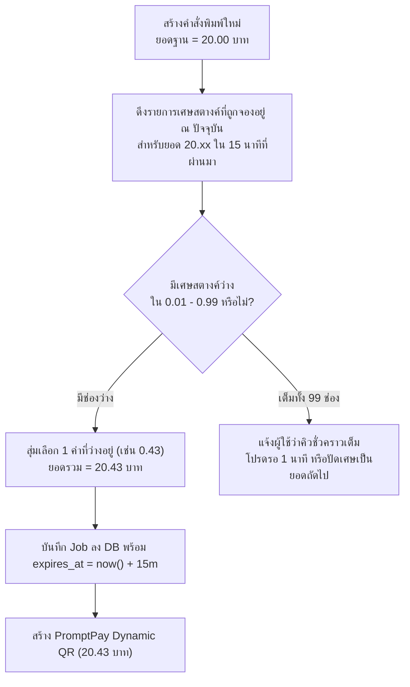
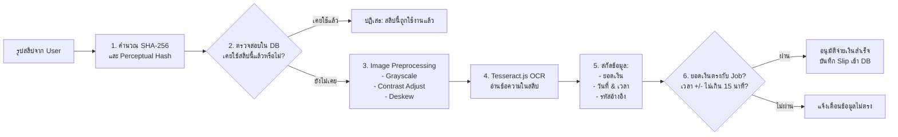

# ระบบชำระเงินแบบผสมผสาน (Hybrid Payment Engine Specification)

เอกสารนี้ระบุการออกแบบระบบชำระเงินแบบ Hybrid ที่ทำให้ตู้พิมพ์สามารถรับเงินและตรวจสอบยอดโอนได้โดย **ไม่มีค่าธรรมเนียมรายเดือน (Zero Commission / Free Gateway)** ผ่านการประสานงานระหว่าง:
1. **Dynamic Satang Engine:** การคำนวณและสุ่มเศษสตางค์เพื่อแยกแยะออร์เดอร์
2. **PromptPay EMVCo Generator:** การสร้าง QR Code ระบุยอดเงินตรงตามมาตรฐานพร้อมเพย์
3. **Flow A (หลัก): Android Bank Notification Webhook:** รับแจ้งเตือนเงินเข้าจากแอปธนาคารบนมือถือ Android
4. **Flow B (สำรอง): OCR Slip Verification:** ระบบสแกนและแกะข้อมูลสลิปธนาคารด้วย AI/OCR

---

## 1. อัลกอริทึมสุ่มเศษสตางค์ (Dynamic Satang Allocation Algorithm)

### 1.1 หลักการทำงาน
การโอนเงินผ่านพร้อมเพย์แบบดั้งเดิมมักเกิดปัญหาหากมีผู้ใช้งาน 2 คนสั่งพิมพ์ราคา 20 บาทพร้อมกัน ธนาคารจะไม่สามารถแยกแยะได้ว่าเงินที่โอนเข้ามาเป็นของใคร 

ระบบแก้ปัญหานี้ด้วย **"การจัดสรรเศษสตางค์แบบมีช่วงเวลา (Time-Windowed Satang Partitioning)"**:
* เศษสตางค์ตั้งแต่ `.01` ถึง `.99` (ทั้งหมด 99 ช่อง)
* ทุกครั้งที่มีการสร้างคิวพิมพ์ ระบบจะตรวจสอบว่าในฐานข้อมูล ณ ขณะนั้น มีงานสถานะ `PENDING_PAYMENT` ที่มี **ยอดเต็มบาทเดียวกัน** จองเศษสตางค์ใดไปแล้วบ้าง
* ระบบจะสุ่มเลือกเศษสตางค์ที่ **ยังว่างอยู่** และล็อกไว้เป็นเวลา **15 นาที (TTL = 900 วินาที)**



### 1.2 โค้ดต้นแบบ Logic การสุ่มเศษสตางค์ (TypeScript)

```typescript
// backend/src/services/pricing.service.ts
import prisma from '../lib/prisma';

export async function allocateSatangForAmount(baseAmountInteger: number): Promise<number> {
  const windowMinutes = 15;
  const cutoffTime = new Date(Date.now() - windowMinutes * 60 * 1000);

  // ดึงเศษสตางค์ที่กำลังถูกใช้งานอยู่ของยอดบาทเดียวกัน
  const activeJobs = await prisma.printJob.findMany({
    where: {
      baseAmount: baseAmountInteger,
      status: 'PENDING_PAYMENT',
      createdAt: { gte: cutoffTime },
    },
    select: { satangAmount: true },
  });

  const occupiedSatangs = new Set(activeJobs.map(job => job.satangAmount));

  // สร้างรายการเศษสตางค์ที่เป็นไปได้ (1 ถึง 99)
  const availableSatangs: number[] = [];
  for (let s = 1; s <= 99; s++) {
    if (!occupiedSatangs.has(s)) {
      availableSatangs.push(s);
    }
  }

  if (availableSatangs.length === 0) {
    throw new Error('All satang slots are occupied for this price point. Please retry shortly.');
  }

  // สุ่มเลือกเศษสตางค์ที่ว่างอยู่
  const randomIndex = Math.floor(Math.random() * availableSatangs.length);
  return availableSatangs[randomIndex]; // เช่น 43 (หมายถึง 0.43 บาท)
}
```

---

## 2. การสร้าง PromptPay Dynamic QR Code (EMVCo Standard)

ระบบใช้มาตรฐานสากล **EMVCo QR Code Specification for Payment Systems** เพื่อสร้าง QR Code ที่ระบุเบอร์โทรศัพท์/เลขประจำตัวผู้เสียภาษี และยอดเงินแบบทศนิยม 2 ตำแหน่ง ทำให้ผู้ใช้สแกนแล้วไม่ต้องพิมพ์ยอดเงินเอง ป้องกันความผิดพลาด 100%

### โครงสร้าง Payload:
* **Tag 00 (Payload Format Indicator):** `"01"`
* **Tag 01 (Point of Initiation):** `"12"` (Dynamic QR - มีการระบุยอดเงิน)
* **Tag 29 (Merchant Account Info - PromptPay):**
  - Sub-tag 00: `"A000000677010111"` (PromptPay Application ID)
  - Sub-tag 01: Mobile Number (`0066...`) หรือ Tax ID (13 หลัก)
* **Tag 53 (Transaction Currency):** `"764"` (รหัสเงินบาทไทย THB)
* **Tag 54 (Transaction Amount):** ยอดเงินรวมเศษสตางค์ เช่น `"25.43"`
* **Tag 58 (Country Code):** `"TH"`
* **Tag 63 (CRC-16 Checksum):** คำนวณตามมาตรฐาน CRC-CCITT (0xFFFF)

---

## 3. Flow A: Android Bank Notification Webhook (ระบบหลัก)

### 3.1 สถาปัตยกรรมการรับแจ้งเตือน
1. ใช้โทรศัพท์ Android ติดตั้งซิมการ์ดหรือต่อ Wi-Fi ประจำตู้ (หรือวางไว้ที่บ้าน/สำนักงาน)
2. มีบัญชีธนาคาร (เช่น กสิกร K PLUS, ไทยพาณิชย์ SCB EASY, หรือกรุงไทย NEXT) ผูกพร้อมเพย์ไว้
3. ติดตั้งแอปพลิเคชันดักฟัง Notification (เช่น Tasker, MacroDroid, หรือ Android Companion Service)
4. เมื่อมีเงินเข้า Notification แจ้งเตือนจะถูกอ่าน และแปลงเป็น HTTP POST ส่งมายังเซิร์ฟเวอร์

### 3.2 ตัวอย่าง Notification Regex แต่ละธนาคาร

| ธนาคาร | รูปแบบข้อความแจ้งเตือน (Sample Notification) | Regular Expression สำหรับดึงยอดเงิน |
|---|---|---|
| **K PLUS (KBANK)** | `เงินเข้า 25.43 บ. จาก xxx-xxx1234 บัญชี xxx-xxx5678` | `/(?:เงินเข้า\|รับโอน)\s*([\d,]+\.\d{2})\s*บ\./i` |
| **SCB EASY** | `เงินเข้า บัญชี xxx-xxx1234 จำนวน 25.43 บาท` | `/เงินเข้า.*จำนวน\s*([\d,]+\.\d{2})\s*บาท/i` |
| **Krungthai NEXT** | `เงินเข้าบ/ช xxx-xxx1234 จำนวน 25.43 บาท` | `/เงินเข้า.*จำนวน\s*([\d,]+\.\d{2})\s*บาท/i` |
| **TTB (ทหารไทยธนชาต)** | `เงินเข้า 25.43 บ. เข้าบัญชี xxx-xxx1234` | `/เงินเข้า\s*([\d,]+\.\d{2})\s*บ\./i` |

### 3.3 โครงสร้าง Webhook Request & Security

**Endpoint:** `POST /api/v1/payments/webhook`

**Headers:**
```http
Content-Type: application/json
X-Webhook-Secret: <ENCRYPTED_PRESHARED_KEY>
```

**Body Payload:**
```json
{
  "bank": "KBANK",
  "rawText": "เงินเข้า 25.43 บ. จาก x-1234 เวลา 14:30 น.",
  "amount": 25.43,
  "timestamp": "2026-09-14T14:30:15+07:00"
}
```

**Security Check:**
1. ตรวจสอบ Header `X-Webhook-Secret` ให้ตรงกับ Environment Variable ของเซิร์ฟเวอร์
2. ป้องกัน Replay Attack โดยตรวจสอบ `timestamp` ไม่ให้ย้อนหลังเกิน 3 นาที

---

## 4. Flow B: OCR Slip Verification (ระบบสำรอง)

เมื่อผู้ใช้โอนเงินสำเร็จแต่ Notification ทางฝั่งธนาคารล่าช้า ผู้ใช้สามารถกดอัปโหลดรูปภาพสลิปได้

### 4.1 ขั้นตอนการประมวลผลสลิป (Pipeline)



### 4.2 การป้องกันการโกงและการใช้สลิปซ้ำ (Anti-Fraud & Replay Prevention)
1. **Slip Image Hash Check:** ทุกสลิปที่ผ่านการอัปโหลดจะถูกเก็บค่า Hash SHA-256 หากมีคนอัปโหลดรูปเดียวกันซ้ำ ระบบจะปฏิเสธทันที
2. **Transaction Ref Extraction:** ดึงเลขอ้างอิงสลิป (เช่น `20260914xxxxxx`) บันทึกเป็น Unique Key ในตาราง `payment_logs`
3. **Time-Drift Window:** เวลาที่ระบุบนสลิปจะต้องเกิดขึ้นหลังจากเวลาสร้างคำสั่งซื้อ (`created_at`) และไม่เกิน 15 นาทีหลังจากนั้น
4. **Target Account Verification:** หากเป็นไปได้ ให้ตรวจสอบข้อความบนสลิปว่ามีเลขบัญชีหรือชื่อผู้รับตรงกับตู้พิมพ์
