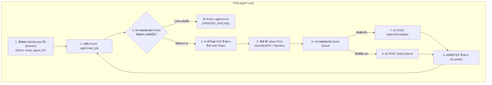

# ข้อกำหนดและการทำงานของตัวกลางสั่งพิมพ์ (Print Agent Specification)

เอกสารนี้ระบุการออกแบบและการทำงานของ **Print Agent** ซึ่งเป็นซอฟต์แวร์บริการขนาดเล็ก (Background Service / Daemon) ที่ติดตั้งอยู่บนเครื่องคอมพิวเตอร์ที่เชื่อมต่อกับเครื่องพิมพ์จริง (ผ่านสาย USB หรือระบบเครือข่าย Local LAN)

---

## 1. บทบาทและหน้าที่ของ Print Agent

Print Agent ทำหน้าที่เป็นสะพานเชื่อมระหว่าง **ระบบคลาวด์/เซิร์ฟเวอร์กลาง (Backend API)** กับ **ฮาร์ดแวร์เครื่องพิมพ์จริง (Physical Printer)** โดยมีหน้าที่รับผิดชอบ:
1. เชื่อมต่อ WebSocket ตลอดเวลากับ Backend เพื่อรอรับคิวงาน (`job:dispatched`)
2. ตรวจสอบความพร้อมของเครื่องพิมพ์ (Online, Ready, กระดาษไม่ติด, ไม่ Offline)
3. ดาวน์โหลดไฟล์ PDF มาเก็บไว้ในพื้นที่ชั่วคราว (Temporary Cache)
4. แปลงคำสั่งการพิมพ์ (ขนาดกระดาษ, โหมดสี, หน้า-หลัง, ถาดกระดาษ) ส่งไปยัง OS Print Spooler แบบ **Silent Print (ไม่มีหน้าต่างเด้งขึ้นมากวน)**
5. ติดตามสถานะจนกระทั่งการพิมพ์เสร็จสิ้น แล้วส่งรายงานผลกลับไปยัง Backend
6. ลบไฟล์เอกสารในเครื่องทิ้งทันที เพื่อความปลอดภัยของข้อมูล

---

## 2. การสั่งพิมพ์บนระบบปฏิบัติการ Windows (Primary OS)

เนื่องจากระบบตู้พิมพ์ส่วนใหญ่และเครื่องที่กำลังพัฒนาทำงานบน **Windows** จึงออกแบบกลไกการสั่งพิมพ์ 2 รูปแบบ:

### 2.1 วิธีที่ 1 (แนะนำสูงสุด): SumatraPDF Command-Line (Headless & Silent)
[SumatraPDF](https://www.sumatrapdfreader.org/) เป็นโปรแกรมอ่านและสั่งพิมพ์ PDF ที่เบา รวดเร็ว มีขนาดไฟล์เล็ก (~10MB) และรองรับการสั่งพิมพ์ผ่าน Command-Line โดยไม่ต้องติดตั้งไดรเวอร์หรือซอฟต์แวร์ขนาดใหญ่

**คำสั่งตัวอย่าง:**
```powershell
SumatraPDF.exe -print-to "RICOH MP C3004" -print-settings "1x,color,duplex,paper=A4,bin=Tray1" "C:\TCprinter\temp\job_12345.pdf"
```

**ตารางพารามิเตอร์การตั้งค่า (`-print-settings`):**

| ความต้องการ | ค่าในพารามิเตอร์ | คำอธิบาย |
|---|---|---|
| **จำนวนชุด (Copies)** | `1x`, `2x`, `5x` | กำหนดจำนวนสำเนา |
| **โหมดสี (Color Mode)** | `color` หรือ `monochrome` | พิมพ์สี หรือ พิมพ์ขาวดำ |
| **การพิมพ์หน้า-หลัง (Duplex)** | `duplex` หรือ `duplexshort` หรือ `simplex` | พลิกด้านยาว (Long-edge), พลิกด้านสั้น, หรือพิมพ์หน้าเดียว |
| **ขนาดกระดาษ (Paper Size)** | `paper=A4`, `paper=A3` | กำหนดขนาดกระดาษ |
| **การเลือกถาด (Tray Selection)** | `bin=Tray1`, `bin=Tray2`, `bin=Auto` | กำหนดช่องถาดกระดาษเป้าหมาย |
| **ช่วงหน้า (Page Range)** | `pages=1-5,8,11-13` | กำหนดเฉพาะหน้าที่ต้องการพิมพ์ |

---

### 2.2 วิธีที่ 2: Windows Native Print Spooler (Python `win32print` / PowerShell)
กรณีที่ต้องการควบคุมลึกถึงระดับ Win32 Spooler API เพื่อตรวจสอบสถานะ Hardware ละเอียด:

```python
# print-agent/windows_spooler.py
import win32print
import win32ui
import win32con

def configure_printer_devmode(printer_name, duplex_mode, color_mode, tray_id):
    # ดึง Handle และ DEVMODE เดิมของเครื่องพิมพ์
    hprinter = win32print.OpenPrinter(printer_name)
    devmode = win32print.GetPrinter(hprinter, 2)['pDevMode']
    
    # กำหนด Duplex: 1=Simplex, 2=Duplex Long-Edge, 3=Duplex Short-Edge
    devmode.Duplex = duplex_mode
    
    # กำหนด Color: 1=Monochrome (ขาวดำ), 2=Color (สี)
    devmode.Color = color_mode
    
    # กำหนด Paper Source / Input Tray (เช่น DMBIN_AUTO, DMBIN_CASSETTE, หรือค่าเฉพาะเครื่อง)
    if tray_id:
        devmode.DefaultSource = tray_id
        
    win32print.ClosePrinter(hprinter)
    return devmode
```

---

## 3. การสั่งพิมพ์บนระบบปฏิบัติการ Linux / Raspberry Pi (CUPS)

กรณีในอนาคตต้องการแปลงตู้เป็น Single Board Computer เช่น Raspberry Pi:

```bash
# พิมพ์ A4 สองหน้า พลิกด้านยาว ขาวดำ ถาดที่ 2
lp -d "Printer_Queue_Name" \
   -o media=A4 \
   -o sides=two-sided-long-edge \
   -o ColorModel=KGray \
   -o InputSlot=Tray2 \
   -n 1 \
   /tmp/job_12345.pdf
```

---

## 4. โครงสร้างและสถาปัตยกรรมของ Print Agent



---

## 5. ตารางรหัสสถานะความผิดพลาดของเครื่องพิมพ์ (Printer Error Codes)

| Error Code | คำอธิบาย | การจัดการของระบบ |
|---|---|---|
| `PRINTER_OFFLINE` | เครื่องพิมพ์ปิดอยู่ หรือสาย USB/LAN หลุด | แจ้งเตือน Admin ผ่าน Line/Dashboard |
| `OUT_OF_PAPER` | กระดาษในถาดที่เลือกหมด | อัปเดตสถานะถาดนั้นเป็น ปิดใช้งาน และเตือน Admin |
| `PAPER_JAM` | กระดาษติดในตัวเครื่อง | หยุดคิวงานอัตโนมัติ ส่งข้อความขอความช่วยเหลือ |
| `SPOOLER_TIMEOUT` | งานค้างใน Print Queue เกิน 120 วินาที | ลองยกเลิกและส่งงานใหม่ (Auto retry 1 ครั้ง) |
| `CORRUPTED_PDF` | ไฟล์ PDF เสียหาย ไม่สามารถเรนเดอร์ได้ | ปฏิเสธงาน และแจ้งคืนเงินหรือติดต่อเจ้าหน้าที่ |
