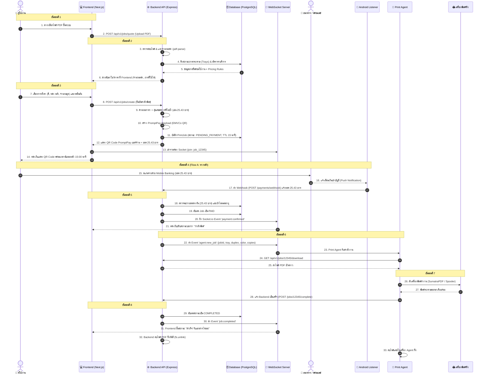
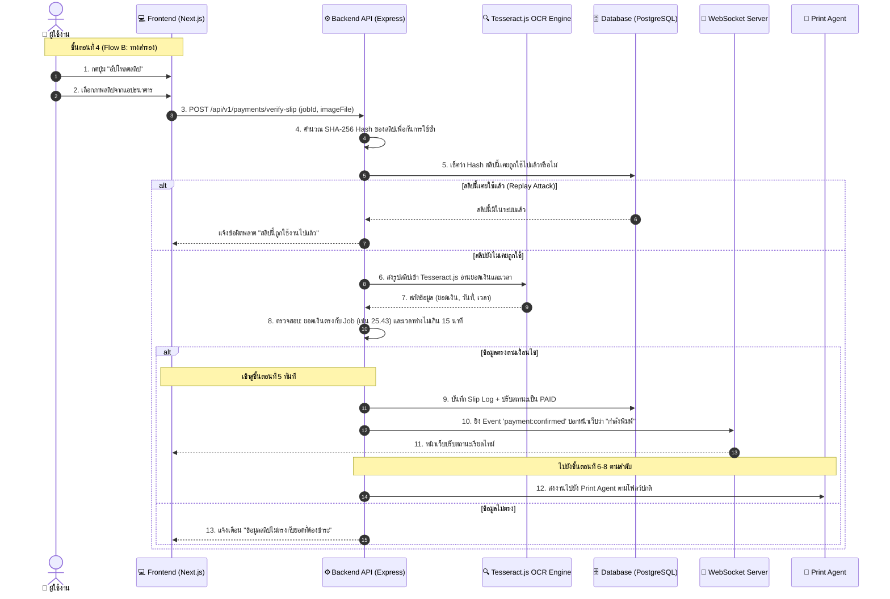

# ลำดับการไหลของข้อมูลในระบบ (System Data Flow & User Journey)

เอกสารนี้แสดงแผนผังการไหลของข้อมูลในระบบ (User Journey Data Flow) ทั้งหมด 8 ขั้นตอน ตั้งแต่ผู้ใช้อัปโหลดไฟล์ไปจนถึงกระดาษพิมพ์ออกมา พร้อม Sequence Diagrams การทำงานอย่างละเอียด

---

## 📌 แผนผังการไหลของข้อมูล 8 ขั้นตอน (User Journey Data Flow)

การทำงานของระบบตู้พิมพ์เอกสารอัตโนมัติ (Automated Print Kiosk) ดำเนินการตาม 8 ขั้นตอนหลักดังนี้:

1. **`User` โยนไฟล์ PDF $\rightarrow$ `Frontend`**  
   ผู้ใช้อัปโหลดไฟล์เอกสารผ่านหน้าเว็บ (รองรับทั้งมือถือและหน้าจอทัชสกรีน)
2. **`Backend` นับหน้า / เช็คถาดกระดาษจาก `Database` $\rightarrow$ ส่งกลับมาโชว์ราคาที่ `Frontend`**  
   ระบบตรวจสอบความถูกต้องของไฟล์ นับจำนวนหน้าอัตโนมัติ ดึงข้อมูลถาดที่พร้อมใช้งานจริงจาก Admin และคำนวณราคาแบบ Real-time แสดงบนหน้าจอ
3. **`User` กดยืนยัน $\rightarrow$ `Backend` สุ่มยอดเศษสตางค์ $\rightarrow$ แสดง QR Code สร้างจาก PromptPay เบอร์ร้าน**  
   ระบบจัดสรรเศษสตางค์ (`.01` - `.99`) ที่ไม่ซ้ำกับคิวอื่นที่รออยู่ใน 15 นาที และสร้าง Dynamic PromptPay QR Code ระบุยอดเงินรวมเศษสตางค์
4. **`User` สแกนจ่ายผ่านแอปธนาคาร**  
   * **Flow A (ช่องทางหลัก):** ธนาคารแจ้งเตือนเข้ามือถือ Android (เครื่องสำรอง) $\rightarrow$ แอปดักจับ Notification ส่ง Webhook มาบอก `Backend`
   * **Flow B (ช่องทางสำรอง - ถ้า A ไม่ทำงาน):** ผู้ใช้กดปุ่ม "อัปโหลดสลิป" $\rightarrow$ `Backend` ส่งรูปสลิปเข้า Tesseract.js (OCR) เพื่ออ่านยอดเงินและเวลา
5. **`Backend` เจอว่ายอดตรงกัน $\rightarrow$ อัปเดต Database $\rightarrow$ ยิง Socket.io บอกหน้าเว็บว่า "กำลังพิมพ์"**  
   ระบบปรับสถานะงานเป็น `PAID` และแจ้งเตือนหน้าจอผู้ใช้แบบสดทันที
6. **`Backend` ส่งไฟล์และตั้งค่าไปให้ `Print Agent`**  
   ระบบส่งคำสั่ง Job Payload (ไฟล์, ถาดกระดาษ, โหมดสี, พิมพ์สองหน้า, จำนวนชุด) ไปยังเครื่องคอมพิวเตอร์ที่ต่อกับเครื่องพิมพ์
7. **`Print Agent` สั่งเครื่องพิมพ์ทำงาน $\rightarrow$ แจ้ง `Backend` เมื่อเสร็จ**  
   Agent รันคำสั่ง OS-level Silent Print สั่งเครื่องพิมพ์จริงทำงาน เมื่อกระดาษพิมพ์เสร็จจะส่ง Callback แจ้งระบบ
8. **`Frontend` ขึ้นสถานะ "สำเร็จ! รับเอกสารได้เลย" $\rightarrow$ `Backend` ลบไฟล์ทิ้ง**  
   หน้าจอผู้ใช้แสดงสถานะเสร็จสิ้น และเซิร์ฟเวอร์ลบไฟล์เอกสารชั่วคราวทิ้งทันที (`fs.unlink`) เพื่อรักษาความปลอดภัยและความเป็นส่วนตัว

---

## 1. Sequence Diagram: ลำดับการทำงานหลัก (Primary Flow - Auto Notification)

---

## 2. Sequence Diagram: ลำดับการทำงานสำรอง (Fallback Flow - OCR Slip Upload)

กรณีที่การแจ้งเตือนจากธนาคารมายังมือถือ Android ล่าช้า ผู้ใช้สามารถกดปุ่มยืนยันด้วยสลิป:

---

## 3. การจัดการกรณีเกิดข้อผิดพลาด (Exception Handling Scenarios)

### กรณี 3.1: กระดาษหมด หรือ เครื่องพิมพ์ติดขัด (Paper Jam / Out of Paper)
1. ระหว่างที่ Spooler สั่งพิมพ์ เครื่องพิมพ์ส่งสถานะแจ้งเตือนข้อผิดพลาดกลับมายัง Print Agent
2. Print Agent ส่งรายงานสถานะกลับมายัง Backend: `POST /api/v1/jobs/:id/error` พร้อมรายละเอียด (`OUT_OF_PAPER_TRAY_1`)
3. Backend:
   - ปรับสถานะถาด Tray 1 ใน Database เป็น `DISABLED` หรือ `OUT_OF_PAPER`
   - กระจาย WebSocket ไปยัง Admin Dashboard ให้ส่งเสียงเตือนผู้ดูแล
   - ส่ง WebSocket ไปยังหน้าจอผู้ใช้: "ขออภัย กระดาษในถาดหมด เจ้าหน้าที่กำลังเดินทางมาเติมกระดาษ คิวงานของคุณถูกบันทึกไว้แล้ว"

### กรณี 3.2: คำสั่งซื้อหมดอายุ (Order Timeout / Expired)
1. หากผู้ใช้เปิดหน้า QR Code ค้างไว้เกิน 15 นาทีโดยไม่ชำระเงิน
2. Backend Background Scheduler (หรือ Node Cron) ทำการกวาด Job ที่ค้างอยู่
3. ปรับสถานะ Job เป็น `EXPIRED`
4. ปลดล็อกเศษสตางค์ (เช่น `.43`) กลับเข้า Pool กลาง เพื่อให้ออร์เดอร์ถัดไปสามารถนำไปสุ่มใช้ได้
5. ส่ง WebSocket แจ้งหน้าเว็บให้แจ้งเตือนผู้ใช้ว่า "คำสั่งซื้อหมดอายุ กรุณากดทำรายการใหม่"
6. สั่งลบไฟล์ PDF ชั่วคราวที่อัปโหลดไว้ทันทีเพื่อประหยัดพื้นที่และรักษาความเป็นส่วนตัว
