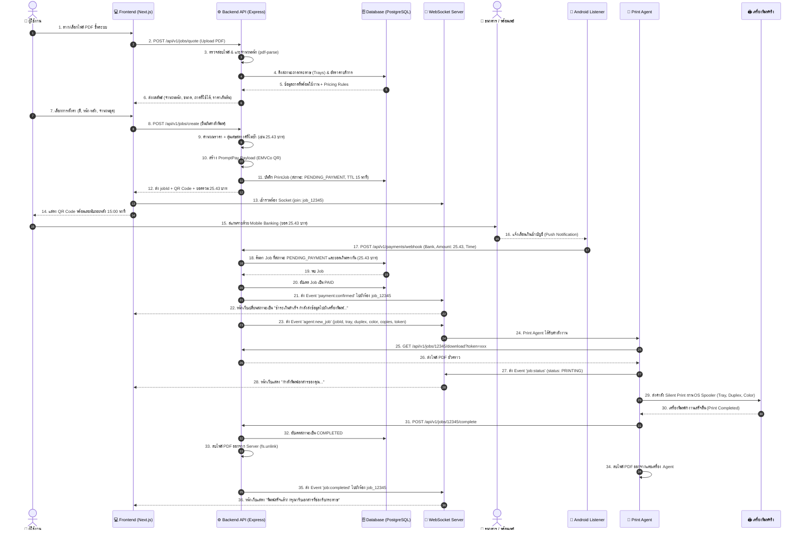
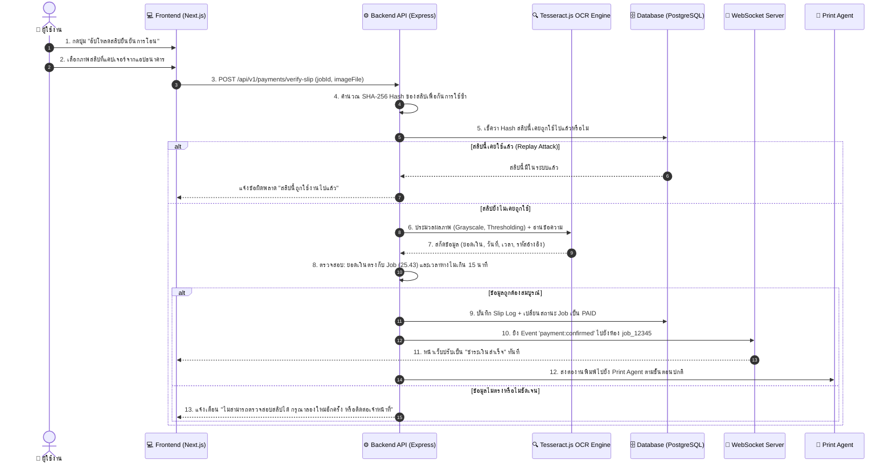

# ลำดับการไหลของข้อมูลในระบบ (System Data Flow & Sequence Diagrams)

เอกสารนี้แสดงลำดับขั้นตอนการทำงานอย่างละเอียด (End-to-End Sequence) ตั้งแต่ผู้ใช้ก้าวเข้ามาใช้งานตู้พิมพ์ อัปโหลดไฟล์ ชำระเงิน ตรวจสอบสถานะ การสั่งพิมพ์ฮาร์ดแวร์ ไปจนถึงการล้างไฟล์ออกจากระบบ

---

## 1. ลำดับการทำงานหลัก (Primary Flow - Standard Auto Notification)

โฟลว์มาตรฐานเมื่อระบบรับชำระเงินทำงานผ่าน Android Notification Listener แบบอัตโนมัติ:

---

## 2. ลำดับการทำงานสำรอง (Fallback Flow - OCR Slip Upload)

กรณีที่การแจ้งเตือนจากธนาคารมายังมือถือ Android ล่าช้า ผู้ใช้สามารถกดปุ่มยืนยันด้วยสลิป:

---

## 3. การจัดการกรณีเกิดข้อผิดพลาด (Exception Handling Scenarios)

### กรณี 3.1: กระดาษหมด หรือ เครื่องพิมพ์ติดขัด (Paper Jam / Out of Paper)
1. ระหว่างที่ Spooler สั่งพิมพ์ เครื่องพิมพ์ส่งสถานะแจ้งเตือนข้อผิดพลาดกลับมายัง Print Agent
2. Print Agent ส่งรายงานสถานะกลับมายัง Backend: `POST /api/v1/jobs/:id/error` พร้อมรายละเอียด (`OUT_OF_PAPER_TRAY_1`)
3. Backend:
   - ปรับสถานะถาด Tray 1 ใน Database เป็น `DISABLED` หรือ `OUT_OF_PAPER`
   - กระจาย WebSocket ไปยัง Admin Dashboard ให้ส่งเสียงเตือนผู้ดูแล
   - ส่ง WebSocket ไปยังหน้าจอผู้ใช้: "ขออภัย กระดาษในถาดหมด เจ้าหน้าที่กำลังเดินทางมาเติมกระดาษ คิวงานของคุณถูกบันทึกไว้แล้ว"

### กรณี 3.2: คำสั่งซื้อหมดอายุ (Order Timeout / Expired)
1. หากผู้ใช้เปิดหน้า QR Code ค้างไว้เกิน 15 นาทีโดยไม่ชำระเงิน
2. Backend Background Scheduler (หรือ Node Cron) ทำการกวาด Job ที่ค้างอยู่
3. ปรับสถานะ Job เป็น `EXPIRED`
4. ปลดล็อกเศษสตางค์ (เช่น `.43`) กลับเข้า Pool กลาง เพื่อให้ออร์เดอร์ถัดไปสามารถนำไปสุ่มใช้ได้
5. ส่ง WebSocket แจ้งหน้าเว็บให้รีเฟรชหรือแจ้งว่า "คำสั่งซื้อหมดอายุ กรุณากดทำรายการใหม่"
6. สั่งลบไฟล์ PDF ชั่วคราวที่อัปโหลดไว้ทันทีเพื่อประหยัดพื้นที่และรักษาความเป็นส่วนตัว
